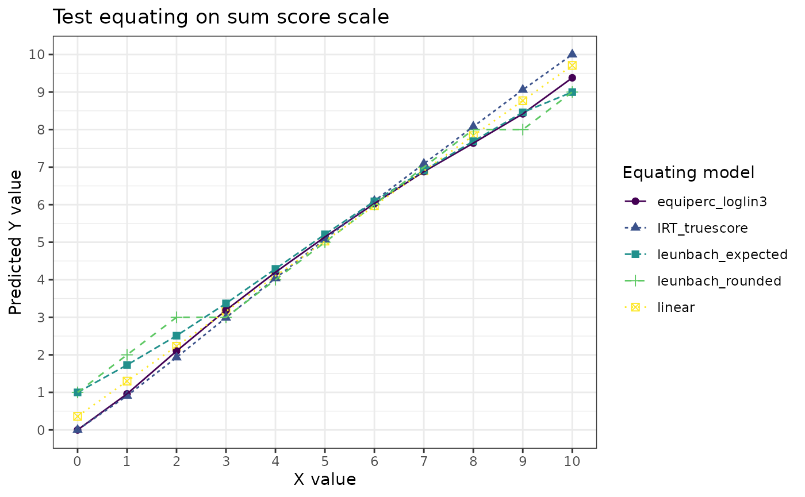
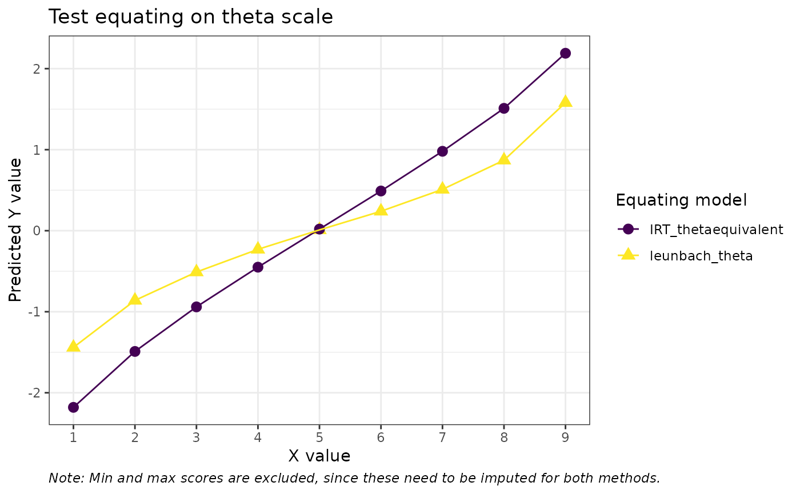

# A brief comparison of test equating methods

``` r
library(dplyr)
library(tidyr)
library(ggplot2)
library(leunbachR)
library(equate)
library(SNSequate)
library(knitr)
library(mirt)
#library(equateMultiple)
#library(SNSequate)
set.seed(1234) # for reproducibility of bootstrap results
d3a_sum <- read.delim("data/data3a.csv", sep = ";")
d3a <- read.delim("data/data3a_item.csv", sep = ",") %>% 
  select(a01:a10,b01:b10)

head(d3a)
```

    ##   a01 a02 a03 a04 a05 a06 a07 a08 a09 a10 b01 b02 b03 b04 b05 b06 b07 b08 b09
    ## 1   0   0   0   1   0   0   0   0   0   0   1   1   0   0   0   0   1   0   0
    ## 2   1   1   0   0   1   0   0   1   0   0   1   1   1   1   0   0   0   0   0
    ## 3   1   0   1   0   1   1   0   0   0   0   1   1   1   1   1   1   1   1   1
    ## 4   1   1   1   1   1   0   1   0   0   0   1   1   1   1   1   1   0   0   0
    ## 5   1   1   1   1   1   1   1   1   0   0   1   1   1   0   1   0   1   1   0
    ## 6   1   1   1   0   1   1   1   0   0   0   1   1   1   1   1   0   0   1   1
    ##   b10
    ## 1   0
    ## 2   0
    ## 3   0
    ## 4   0
    ## 5   0
    ## 6   1

While the Leunbach method allows for test equating based on observed sum
scores under the assumption that the underlying data fits a Rasch model
adequately, most other methods require item-level response data. For
this comparison, we will use the item data that produced the sum scores
used in the intro vignette.

We will focus on comparing IRT true (and observed?) score equating
methods.

## Direct equating

``` r
mod1 <- mirt(d3a[,1:10], 1, 'Rasch', verbose = FALSE) 
mod2 <- mirt(d3a[,11:20], 1, 'Rasch', verbose = FALSE) 

coef_ls1 <- list(a = rep(1,10), 
                 b = coef(mod1, simplify=TRUE, IRTpars = TRUE)$item[,'b'],
                 c = rep(0,10))
coef_ls2 <- list(a = rep(1,10), 
                 b = coef(mod2, simplify=TRUE, IRTpars = TRUE)$item[,'b'],
                 c = rep(0,10))

req1 <- irt.eq(n_items = 10, coef_ls1, coef_ls2, method="TS", A=1, B=0) # true score
rx <- freqtab(rowSums(d3a[,1:10]), scales = 0:10) 
ry <- freqtab(rowSums(d3a[,11:20]), scales = 0:10) 
req2 <- equate(rx, ry, type = "i") # identity 
req3 <- equate(rx, ry, type = "l") # linear 
req4 <- equate(rx, ry, type = "e", smooth = "loglin", degrees = 3) # equipercentile with loglinear smoothing

# Leunbach model
lfit <- leunbach_ipf(d3a_sum)
```

    ## Warning in leunbach_ipf(d3a_sum): Removed 2 rows with missing values

``` r
#leunbach_equate(lfit)
lboot <- leunbach_bootstrap(lfit, n_cores = 4, nsim = 100)
leq <- get_equating_table(lboot)

# summary table
max_score <- 10 
eq_table <- data.frame(identity = pmin(pmax(req2$conc$yx, 0), max_score), 
                       linear = pmin(pmax(req3$conc$yx, 0), max_score), 
                       equiperc_loglin3 = pmin(pmax(req4$conc$yx, 0), max_score),
                       leunbach_rounded = leq$rounded,
                       IRT_truescore = req1$tau_y, 
                       leunbach_expected = leq$expected,
                       IRT_thetaequivalent = req1$theta_equivalent,
                       leunbach_theta = leq$log_theta
                       ) %>% 
  round(2)

kable(eq_table)
```

| identity | linear | equiperc_loglin3 | leunbach_rounded | IRT_truescore | leunbach_expected | IRT_thetaequivalent | leunbach_theta |
|---------:|-------:|-----------------:|-----------------:|--------------:|------------------:|--------------------:|---------------:|
|        0 |   0.36 |             0.00 |                1 |          0.00 |              1.00 |                  NA |          -5.00 |
|        1 |   1.30 |             0.96 |                2 |          0.91 |              1.73 |               -2.18 |          -1.44 |
|        2 |   2.23 |             2.10 |                3 |          1.93 |              2.51 |               -1.49 |          -0.86 |
|        3 |   3.16 |             3.19 |                3 |          2.99 |              3.37 |               -0.94 |          -0.51 |
|        4 |   4.10 |             4.20 |                4 |          4.04 |              4.29 |               -0.45 |          -0.23 |
|        5 |   5.03 |             5.14 |                5 |          5.08 |              5.21 |                0.02 |           0.01 |
|        6 |   5.97 |             6.03 |                6 |          6.10 |              6.09 |                0.49 |           0.24 |
|        7 |   6.90 |             6.88 |                7 |          7.09 |              6.91 |                0.98 |           0.51 |
|        8 |   7.84 |             7.64 |                8 |          8.08 |              7.69 |                1.51 |           0.87 |
|        9 |   8.77 |             8.42 |                8 |          9.06 |              8.46 |                2.19 |           1.58 |
|       10 |   9.71 |             9.38 |                9 |         10.00 |              9.00 |                  NA |           5.00 |

``` r
eq_table %>% 
  select(!c(leunbach_theta,IRT_thetaequivalent)) %>% 
  pivot_longer(!identity) %>% 
  ggplot(aes(x = identity, y = value, color = name, shape = name, linetype = name)) +
  geom_point(size = 2) + 
  geom_line() +
  scale_x_continuous(breaks = c(0:10), minor_breaks = NULL) +
  scale_y_continuous(breaks = c(0:10)) +
  scale_color_viridis_d() +
  theme_bw() +
  labs(title = "Test equating on sum score scale",
       color = "Equating model", shape = "Equating model", linetype = "Equating model",
       y = "Predicted Y value", x = "X value")
```



``` r
eq_table %>% 
  select(c(identity,leunbach_theta,IRT_thetaequivalent)) %>% 
  pivot_longer(!identity) %>% 
  filter(identity %in% c(1:9)) %>% 
  ggplot(aes(x = identity, y = value, color = name, shape = name)) +
  geom_point(size = 3) + 
  geom_line() +
  scale_x_continuous(breaks = c(0:10), minor_breaks = NULL) +
  scale_y_continuous(breaks = c(-2:2)) +
  scale_color_viridis_d() +
  theme_bw() +
  labs(title = "Test equating on theta scale",
       color = "Equating model", shape = "Equating model",
       y = "Predicted Y value", x = "X value", caption = "Note: Min and max scores are excluded, since these need to be imputed for both methods.") +
  theme(plot.caption = element_text(face = "italic", hjust = 0))
```



## Indirect equating

``` r
#library(equateMultiple) #?
data1 <- read.delim("data/data1_item.csv", sep = ",") %>% 
  select(a01:a10,b01:b10,c01:c10)
```
