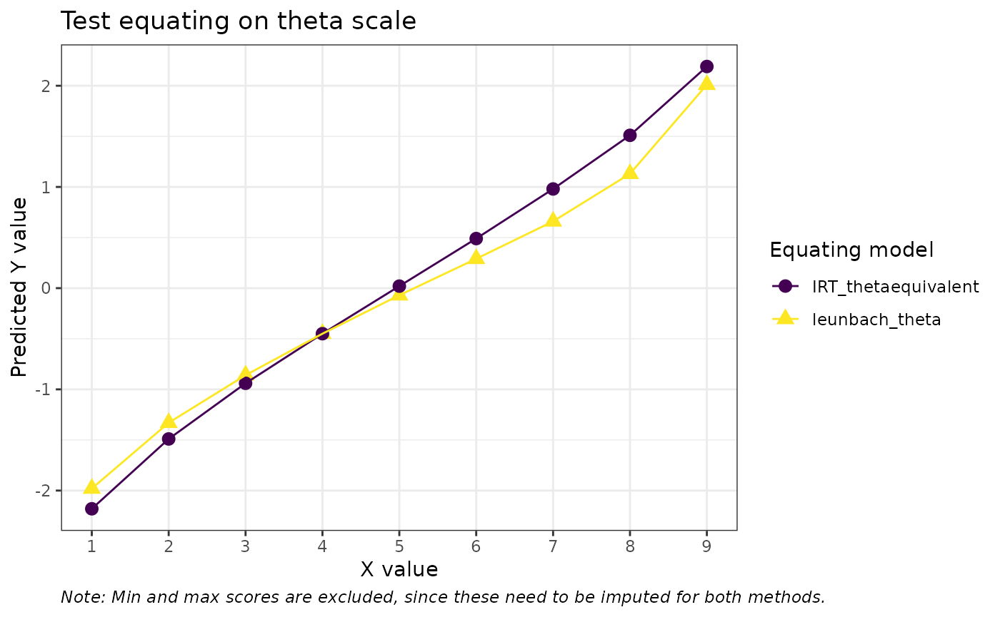
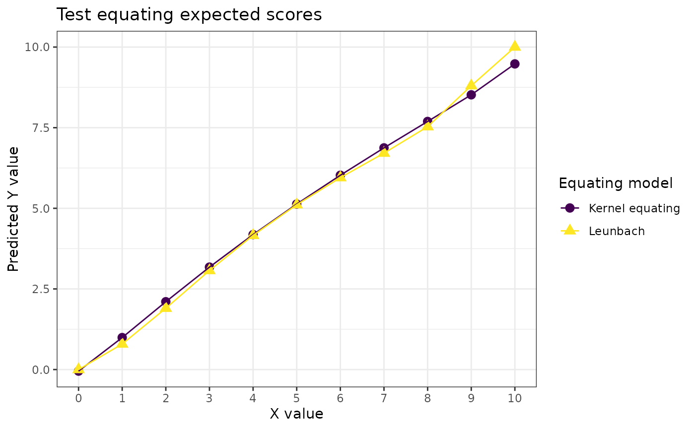
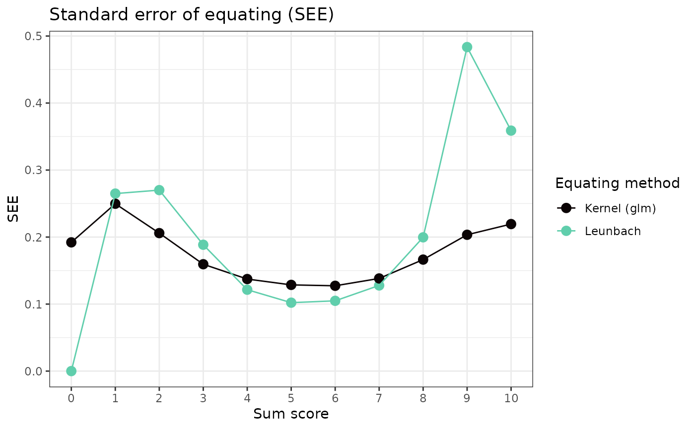

# A brief comparison of test equating methods

``` r
library(dplyr)
library(tidyr)
library(ggplot2)
library(leunbachR)
library(equate)
library(SNSequate)
library(knitr)
library(mirt)
library(kequate)
set.seed(1234) # for reproducibility of bootstrap results
select <- dplyr::select
d3a_sum <- read.delim("data/data3a_item.csv", sep = ",") %>% 
  select(a01:a10,b01:b10) %>% 
  mutate(a_sum = rowSums(across(c(a01:a10))),
         b_sum = rowSums(across(c(b01:b10)))) %>% 
  select(a_sum,b_sum)
d3a <- read.delim("data/data3a_item.csv", sep = ",") %>% 
  select(a01:a10,b01:b10)
# d3a_theta <- read.delim("data/data3a_item.csv", sep = ",") %>% 
#   select(theta1,theta2) %>% 
#   round(2)
head(d3a)
```

    ##   a01 a02 a03 a04 a05 a06 a07 a08 a09 a10 b01 b02 b03 b04 b05 b06 b07 b08 b09
    ## 1   0   0   0   1   0   0   0   0   0   0   1   1   0   0   0   0   1   0   0
    ## 2   1   1   0   0   1   0   0   1   0   0   1   1   1   1   0   0   0   0   0
    ## 3   1   0   1   0   1   1   0   0   0   0   1   1   1   1   1   1   1   1   1
    ## 4   1   1   1   1   1   0   1   0   0   0   1   1   1   1   1   1   0   0   0
    ## 5   1   1   1   1   1   1   1   1   0   0   1   1   1   0   1   0   1   1   0
    ## 6   1   1   1   0   1   1   1   0   0   0   1   1   1   1   1   0   0   1   1
    ##   b10
    ## 1   0
    ## 2   0
    ## 3   0
    ## 4   0
    ## 5   0
    ## 6   1

While the Leunbach method allows for test equating based on observed sum
scores under the assumption that the underlying data fits a Rasch model
adequately, most other methods require item-level response data. For
this comparison, we will use the item data that produced the sum scores
used in the intro vignette.

We will focus on comparing IRT true score equating methods, but also
include some other methods.

## Direct equating

``` r
mod1 <- mirt(d3a[,1:10], 1, 'Rasch', verbose = FALSE) 
mod2 <- mirt(d3a[,11:20], 1, 'Rasch', verbose = FALSE) 

coef_ls1 <- list(a = rep(1,10), 
                 b = coef(mod1, simplify=TRUE, IRTpars = TRUE)$item[,'b'],
                 c = rep(0,10))
coef_ls2 <- list(a = rep(1,10), 
                 b = coef(mod2, simplify=TRUE, IRTpars = TRUE)$item[,'b'],
                 c = rep(0,10))

req1 <- irt.eq(n_items = 10, coef_ls1, coef_ls2, method="TS", A=1, B=0) # true score
rx <- freqtab(rowSums(d3a[,1:10]), scales = 0:10) 
ry <- freqtab(rowSums(d3a[,11:20]), scales = 0:10) 
req2 <- equate(rx, ry, type = "i") # identity 
req3 <- equate(rx, ry, type = "l") # linear 
req4 <- equate(rx, ry, type = "e", smooth = "loglin", degrees = 3) # equipercentile with loglinear smoothing

# Leunbach model
lfit <- leunbach_ipf(d3a_sum)
#leq <- leunbach_equate(lfit)
#leq[["equating_table"]]
lboot <- leunbach_bootstrap(lfit, n_cores = 4, nsim = 100)
leq <- get_equating_table(lboot)
```

``` r
# summary table
max_score <- 10 
eq_table <- data.frame(identity = pmin(pmax(req2$conc$yx, 0), max_score), 
                       linear = pmin(pmax(req3$conc$yx, 0), max_score), 
                       equiperc_loglin3 = pmin(pmax(req4$conc$yx, 0), max_score),
                       leunbach_rounded = leq$rounded,
                       IRT_truescore = req1$tau_y, 
                       leunbach_expected = leq$expected,
                       IRT_thetaequivalent = req1$theta_equivalent,
                       leunbach_theta = leq$log_theta
                       ) %>% 
  round(2)

kable(eq_table)
```

| identity | linear | equiperc_loglin3 | leunbach_rounded | IRT_truescore | leunbach_expected | IRT_thetaequivalent | leunbach_theta |
|---------:|-------:|-----------------:|-----------------:|--------------:|------------------:|--------------------:|---------------:|
|        0 |   0.36 |             0.00 |                0 |          0.00 |              0.00 |                  NA |          -5.00 |
|        1 |   1.30 |             0.96 |                1 |          0.91 |              0.79 |               -2.18 |          -1.98 |
|        2 |   2.23 |             2.10 |                2 |          1.93 |              1.90 |               -1.49 |          -1.33 |
|        3 |   3.16 |             3.19 |                3 |          2.99 |              3.07 |               -0.94 |          -0.86 |
|        4 |   4.10 |             4.20 |                4 |          4.04 |              4.16 |               -0.45 |          -0.45 |
|        5 |   5.03 |             5.14 |                5 |          5.08 |              5.11 |                0.02 |          -0.07 |
|        6 |   5.97 |             6.03 |                6 |          6.10 |              5.95 |                0.49 |           0.29 |
|        7 |   6.90 |             6.88 |                7 |          7.09 |              6.71 |                0.98 |           0.66 |
|        8 |   7.84 |             7.64 |                8 |          8.08 |              7.53 |                1.51 |           1.13 |
|        9 |   8.77 |             8.42 |                9 |          9.06 |              8.80 |                2.19 |           2.01 |
|       10 |   9.71 |             9.38 |               10 |         10.00 |             10.00 |                  NA |           5.00 |

``` r
eq_table %>% 
  select(!c(leunbach_theta,IRT_thetaequivalent)) %>% 
  pivot_longer(!identity) %>% 
  ggplot(aes(x = identity, y = value, color = name, shape = name, linetype = name)) +
  geom_point(size = 2) + 
  geom_line() +
  scale_x_continuous(breaks = c(0:10), minor_breaks = NULL) +
  scale_y_continuous(breaks = c(0:10)) +
  scale_color_viridis_d() +
  theme_bw() +
  labs(title = "Test equating on sum score scale",
       color = "Equating model", shape = "Equating model", linetype = "Equating model",
       y = "Predicted Y value", x = "X value")
```


``` r
eq_table %>% 
  select(c(identity,leunbach_theta,IRT_thetaequivalent)) %>% 
  pivot_longer(!identity) %>% 
  filter(identity %in% c(1:9)) %>% 
  ggplot(aes(x = identity, y = value, color = name, shape = name)) +
  geom_point(size = 3) + 
  geom_line() +
  scale_x_continuous(breaks = c(0:10), minor_breaks = NULL) +
  scale_y_continuous(breaks = c(-2:2)) +
  scale_color_viridis_d() +
  theme_bw() +
  labs(title = "Test equating on theta scale",
       color = "Equating model", shape = "Equating model",
       y = "Predicted Y value", x = "X value", caption = "Note: Min and max scores are excluded, since these need to be imputed for both methods.") +
  theme(plot.caption = element_text(face = "italic", hjust = 0))
```



### Kernel equating

We’ll apply the equivalent groups design, following the `kequate`
package vignette (Andersson, Bränberg, and Wiberg 2022). First, we fit
two separate generalized linear models (GLM) using the poisson
distribution for the counts of each score. The `kequate` vignette
suggests using AIC to evaluate model fit (lower values are better) and
finding the optimal number of moments to include in the model
specification. I have opted for using basis splines instead, and
adjusting the degrees of freedom based on AIC. The
[`glm()`](https://rdrr.io/r/stats/glm.html) output objects are then used
by the [`kequate()`](https://rdrr.io/pkg/kequate/man/kequate.html)
function.

Notably, kernel equating also allows for equating using only sum scores.

``` r
glm_a <- glm(count ~ splines::bs(total, df = 3),
  family = "poisson", data = rx, x = TRUE)
glm_b <- glm(count ~ splines::bs(total, df = 3),
  family = "poisson", data = ry, x = TRUE)

eg_eq <- kequate(
  design = "EG",
  r = glm_a, s = glm_b,
  x = c(0:10), y = c(0:10)
)
```

``` r
data.frame(
  predicted = c(eg_eq@equating$eqYx, leq$expected),
  Model = c(rep("Kernel equating",11),rep("Leunbach",11)),
  sumscore = c(0:10,0:10)
  ) %>% 
  ggplot(aes(x = sumscore, y = predicted, color = Model, shape = Model)) +
  geom_point(size = 3) + 
  geom_line() +
  scale_x_continuous(breaks = c(0:10), minor_breaks = NULL) +
  #scale_y_continuous(breaks = c(-2:2)) +
  scale_color_viridis_d() +
  theme_bw() +
  labs(title = "Test equating expected scores",
       color = "Equating model", shape = "Equating model",
       y = "Predicted Y value", x = "X value") +
  theme(plot.caption = element_text(face = "italic", hjust = 0))
```



### Standard error of equating

In order to make reasonable comparisons between kernel equating and
Leunbach, we need to use the expected values for estimating standard
errors of equating (SEE) in the Leunbach bootstrap, rather than the
rounded values (default). It should be noted that the methods of
estimating SEE are different for these two equating models.

``` r
lboot2 <- leunbach_bootstrap(lfit, n_cores = 4, nsim = 100, see_type = "expected")

data.frame(score = c(0:10,0:10),
           see = c(lboot2[["see_1to2"]],eg_eq@equating$SEEYx),
           model = c(rep("Leunbach",11),rep("Kernel (glm)",11))
) %>% ggplot(aes(x=score,y=see, color = model)) +
  geom_point(size = 3) +
  geom_line() +
  theme_bw() +
  scale_x_continuous(breaks = c(0:10), minor_breaks = NULL) +
  scale_color_viridis_d(option = "G", end = 0.8) +
  labs(title = "Standard error of equating (SEE)",
       x = "Sum score", y = "SEE", color = "Equating method")
```



## References

Andersson, Björn, Kenny Bränberg, and Marie Wiberg. 2022. “Kequate: The
Kernel Method of Test Equating.”
<https://cran.uni-muenster.de/web/packages/kequate/index.html>.
