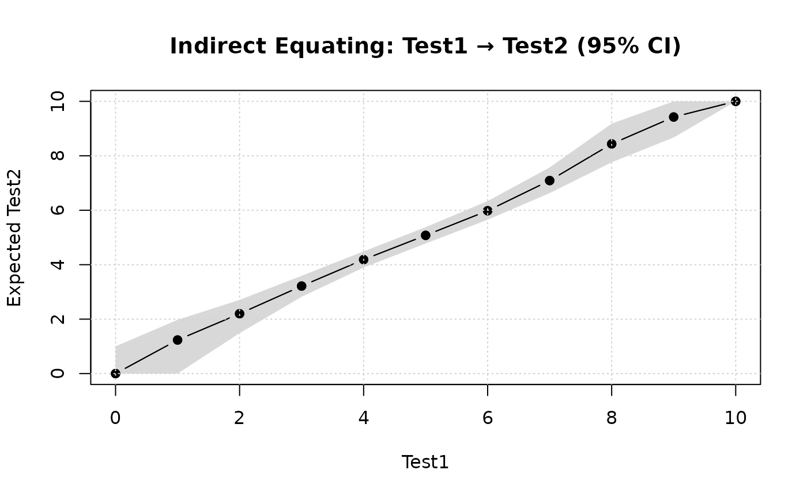

# Introduction to Leunbach test equating

This document provides an overview of how to do direct and indirect
equating using the `leunbachR` package for R.

## Setup

First, we load the package and a dataset.

``` r
library(leunbachR)
set.seed(1234) # for reproducibility of bootstrap results
d3a <- read.delim("./data/data3a.csv", sep = ";")
```

Looking at our data, we can see that it has two variables containing sum
scores from the two tests that we want to equate.

``` r
head(d3a)
```

    ##   a_sum c_sum
    ## 1     1     8
    ## 2     4     4
    ## 3     4     7
    ## 4     6     3
    ## 5     8     5
    ## 6     6     6

## Direct equating

First, we estimate the model.

``` r
fit <- leunbach_ipf(d3a, verbose = FALSE)
```

    ## Warning in leunbach_ipf(d3a, verbose = FALSE): Removed 2 rows with missing
    ## values

For most functions in this package, you can use
[`print()`](https://rdrr.io/r/base/print.html),
[`summary()`](https://rdrr.io/r/base/summary.html), and
[`plot()`](https://rdrr.io/r/graphics/plot.default.html) to investigate
the results. All functions have documentation that you can access using
for instance
[`?leunbach_ipf`](https://pgmj.github.io/leunbachR/reference/leunbach_ipf.md)
in the R console.

``` r
summary(fit)
```

    ## Leunbach Score Parameter Estimation - Summary
    ## ==============================================
    ## Power Series Distribution with Generalized Symmetric Functions
    ## 
    ## N = 498 observations
    ## Test 1: scores 0 to 10 (observed:  0 to 10)
    ## Test 2: scores 0 to 9 (observed: 1 to 9)
    ## Total:  scores 0 to 19 (observed:  1 to 19)
    ## 
    ## === Goodness of Fit ===
    ## 
    ## 1. Likelihood Ratio Test (observed vs expected counts):
    ##    Likelihood ratio G² =    53.75 (df = 63, p = 0.7904)
    ##    Pearson chi-square  =    49.08
    ## 
    ## 2. Goodman-Kruskal Gamma Test (one-sided):
    ##    Tests if observed correlation exceeds expected under the model.
    ##    Gamma (observed)    =   0.0005
    ##    Gamma (expected)    =  -0.0032
    ##    Standard error      = 3671.3724
    ##    Z statistic         =    -0.00 (p = 0.5000, one-sided)
    ## 
    ## 3. Orbit Analysis (person fit):
    ##    Run analyze_orbits() separately to assess the number of cases
    ##    outside 95% confidence regions of orbit distributions.
    ## 
    ## Converged: TRUE (after 23 iterations)

``` r
print(fit)
```

    ## Leunbach Score Parameter Estimation
    ## ====================================
    ## Power Series Distribution with Generalized Symmetric Functions
    ## 
    ## N = 498 observations
    ## 
    ## Test 1 score parameters (gamma):
    ## 
    ##  Score Frequency     Gamma Log_Gamma
    ##      0         4  1.000000  0.000000
    ##      1        15  3.307358  1.196150
    ##      2        33  6.817996  1.919566
    ##      3        72 14.259080  2.657394
    ##      4        84 16.280189  2.789949
    ##      5        94 18.105331  2.896206
    ##      6        88 17.476723  2.860870
    ##      7        44  9.027916  2.200322
    ##      8        41  8.427631  2.131516
    ##      9        20  4.179715  1.430243
    ##     10         3  0.651356 -0.428699
    ## 
    ## Test 2 score parameters (delta):
    ## 
    ##  Score Frequency    Delta Log_Delta
    ##      0         0 0.000000        NA
    ##      1        12 1.000000  0.000000
    ##      2        32 2.453814  0.897644
    ##      3        57 4.122441  1.416445
    ##      4        88 6.247856  1.832238
    ##      5        84 6.072293  1.803736
    ##      6        89 6.343274  1.847395
    ##      7        73 5.337807  1.674815
    ##      8        43 3.203051  1.164104
    ##      9        20 1.535259  0.428699
    ## 
    ## Total score parameters (sigma = Test1 + Test2):
    ## 
    ##  Score Frequency      Sigma Log_Sigma
    ##      0         0   0.000000        NA
    ##      1         0   1.000000  0.000000
    ##      2         0   5.761172  1.751141
    ##      3         2  19.056078  2.947386
    ##      4         4  50.871418  3.929301
    ##      5        14 106.112295  4.664498
    ##      6        25 185.860485  5.224996
    ##      7        39 285.824799  5.655379
    ##      8        54 378.957812  5.937425
    ##      9        70 453.576111  6.117163
    ##     10        61 487.507508  6.189306
    ##     11        61 466.066469  6.144328
    ##     12        82 407.843796  6.010884
    ##     13        35 313.515021  5.747847
    ##     14        21 214.873301  5.370049
    ##     15        13 131.201551  4.876735
    ##     16        11  67.296568  4.209109
    ##     17         5  29.803253  3.394618
    ##     18         1   8.503273  2.140451
    ##     19         0   1.000000  0.000000
    ## 
    ## Converged:  TRUE (after 23 iterations)
    ## 
    ## --- Goodness of Fit ---
    ## 
    ## 1. Likelihood Ratio Test:
    ##    LR = 53.75  DF = 63  p = 0.7904
    ## 
    ## 2. Goodman-Kruskal Gamma Test (one-sided):
    ##    Gamma (observed) = 0.0005
    ##    Gamma (expected) = -0.0032
    ##    SE = 3671.3724
    ##    Z = -0.00  p = 0.5000
    ## 
    ## 3. Orbit Analysis:
    ##    Use analyze_orbits() to assess person fit within total score strata

### Analyze orbits

``` r
orb <- analyze_orbits(fit)
summary(orb)
```

    ## Leunbach Orbit Analysis - Summary
    ## ==================================
    ## 
    ## Significant differences between Test1 and Test2:
    ##   Test1  Test2     N    P(T1<T2)   P(T1>T2)
    ##   --------------------------------------------
    ##       0      6      1    0.0341          
    ##       0      7      1    0.0187          
    ##       0      8      1    0.0085          
    ##       1      8      3    0.0267          
    ##       1      9      2    0.0104          
    ##       2      9      1    0.0225          
    ##       8      1      2              0.0186
    ##       9      2      4              0.0234
    ##       9      3      3              0.0462
    ##      10      5      1              0.0301
    ## 
    ## 19 (3.8%) persons with significant differences
    ## 15.3 (3.1%) expected
    ## 
    ## 95% CI: [1.6%, 4.6%]
    ## Chi-square = 0.91, df = 1, p = 0.3388

``` r
print(orb)
```

    ## Leunbach Orbit Analysis
    ## =======================
    ## 
    ## N = 498 observations
    ## Significance level:  5.0%
    ## 
    ## Critical levels for person fit assessment:
    ## 
    ##  Score  N Crit_Left Crit_Right Crit_Combined DF
    ##      3  2     0.000      0.000         0.000  3
    ##      4  4     0.000      0.000         0.000  4
    ##      5 14     0.000      0.000         0.000  5
    ##      6 25     3.413      0.000         3.413  6
    ##      7 39     1.868      0.000         1.868  7
    ##      8 54     0.845      2.382         3.228  8
    ##      9 70     2.674      1.858         4.532  9
    ##     10 61     1.042      0.857         1.899  9
    ##     11 61     2.246      2.340         4.586  8
    ##     12 82     0.000      4.617         4.617  7
    ##     13 35     0.000      0.856         0.856  6
    ##     14 21     0.000      1.894         1.894  5
    ##     15 13     0.000      3.015         3.015  4
    ##     16 11     0.000      0.000         0.000  3
    ##     17  5     0.000      0.000         0.000  2
    ##     18  1     0.000      0.000         0.000  1
    ## 
    ## 19 (3.8%) persons with significant differences between measurements
    ## 15.3 (3.1%) expected
    ## 
    ## 95% Confidence interval: [1.6%, 4.6%]
    ## Chi-square = 0.91, df = 1, p = 0.3388

``` r
plot(orb)
```


``` r
plot(orb, type = "significant")
```


Specific total scores can also be analyzed.

``` r
get_orbit(orb, total_score = 5)
```

    ##   test1 test2 expected_pct cum_left cum_right observed
    ## 1     0     5         5.72     5.72    100.00        0
    ## 2     1     4        19.47    25.20     94.28        1
    ## 3     2     3        26.49    51.68     74.80        6
    ## 4     3     2        32.97    84.66     48.32        4
    ## 5     4     1        15.34   100.00     15.34        3
    ## 6     5     0         0.00   100.00      0.00        0

### Equating

``` r
leunbach_equate(fit, verbose = TRUE, direction = "1to2")
```

    ## Equating Test1 to Test2 (method: optimize)
    ## ==========================================
    ## 
    ##  Test1 Expected_Test2 Rounded_Test2
    ##      0       1.000000             1
    ##      1       1.732598             2
    ##      2       2.505289             3
    ##      3       3.367583             3
    ##      4       4.291332             4
    ##      5       5.214895             5
    ##      6       6.091660             6
    ##      7       6.910866             7
    ##      8       7.693731             8
    ##      9       8.460804             8
    ##     10       9.000000             9

    ## Leunbach Equating:  Test1 to Test2
    ## Method: optimize
    ## ================================
    ## 
    ##  Test1 Expected_Test2 Rounded_Test2
    ##      0           1.00             1
    ##      1           1.73             2
    ##      2           2.51             3
    ##      3           3.37             3
    ##      4           4.29             4
    ##      5           5.21             5
    ##      6           6.09             6
    ##      7           6.91             7
    ##      8           7.69             8
    ##      9           8.46             8
    ##     10           9.00             9

### Bootstrap

If you have installed the package `mirai` and have a computer with
multiple CPU cores, you can significantly reduce the time needed for
bootstrap. Note that not all cores are equal. For instance, on a modern
Mac, you should only use the “performance cores”, not the “efficiency
cores”.

``` r
boot <- leunbach_bootstrap(fit, n_cores = 4, verbose = TRUE)
```

    ## Parametric Bootstrap for Leunbach Model
    ## ========================================
    ## 
    ## Optimization method: optimize
    ## Running 1000 bootstrap samples using 4 cores...
    ## 
    ## Starting 4 daemons...
    ##   |                                                                              |                                                                      |   0%  |                                                                              |                                                                      |   1%  |                                                                              |=                                                                     |   1%  |                                                                              |=                                                                     |   2%  |                                                                              |==                                                                    |   2%  |                                                                              |==                                                                    |   3%  |                                                                              |==                                                                    |   4%  |                                                                              |===                                                                   |   4%  |                                                                              |===                                                                   |   5%  |                                                                              |====                                                                  |   5%  |                                                                              |====                                                                  |   6%  |                                                                              |=====                                                                 |   6%  |                                                                              |=====                                                                 |   7%  |                                                                              |=====                                                                 |   8%  |                                                                              |======                                                                |   8%  |                                                                              |======                                                                |   9%  |                                                                              |=======                                                               |   9%  |                                                                              |=======                                                               |  10%  |                                                                              |=======                                                               |  11%  |                                                                              |========                                                              |  11%  |                                                                              |========                                                              |  12%  |                                                                              |=========                                                             |  12%  |                                                                              |=========                                                             |  13%  |                                                                              |=========                                                             |  14%  |                                                                              |==========                                                            |  14%  |                                                                              |==========                                                            |  15%  |                                                                              |===========                                                           |  15%  |                                                                              |===========                                                           |  16%  |                                                                              |============                                                          |  16%  |                                                                              |============                                                          |  17%  |                                                                              |============                                                          |  18%  |                                                                              |=============                                                         |  18%  |                                                                              |=============                                                         |  19%  |                                                                              |==============                                                        |  19%  |                                                                              |==============                                                        |  20%  |                                                                              |==============                                                        |  21%  |                                                                              |===============                                                       |  21%  |                                                                              |===============                                                       |  22%  |                                                                              |================                                                      |  22%  |                                                                              |================                                                      |  23%  |                                                                              |================                                                      |  24%  |                                                                              |=================                                                     |  24%  |                                                                              |=================                                                     |  25%  |                                                                              |==================                                                    |  25%  |                                                                              |==================                                                    |  26%  |                                                                              |===================                                                   |  26%  |                                                                              |===================                                                   |  27%  |                                                                              |===================                                                   |  28%  |                                                                              |====================                                                  |  28%  |                                                                              |====================                                                  |  29%  |                                                                              |=====================                                                 |  29%  |                                                                              |=====================                                                 |  30%  |                                                                              |=====================                                                 |  31%  |                                                                              |======================                                                |  31%  |                                                                              |======================                                                |  32%  |                                                                              |=======================                                               |  32%  |                                                                              |=======================                                               |  33%  |                                                                              |=======================                                               |  34%  |                                                                              |========================                                              |  34%  |                                                                              |========================                                              |  35%  |                                                                              |=========================                                             |  35%  |                                                                              |=========================                                             |  36%  |                                                                              |==========================                                            |  36%  |                                                                              |==========================                                            |  37%  |                                                                              |==========================                                            |  38%  |                                                                              |===========================                                           |  38%  |                                                                              |===========================                                           |  39%  |                                                                              |============================                                          |  39%  |                                                                              |============================                                          |  40%  |                                                                              |============================                                          |  41%  |                                                                              |=============================                                         |  41%  |                                                                              |=============================                                         |  42%  |                                                                              |==============================                                        |  42%  |                                                                              |==============================                                        |  43%  |                                                                              |==============================                                        |  44%  |                                                                              |===============================                                       |  44%  |                                                                              |===============================                                       |  45%  |                                                                              |================================                                      |  45%  |                                                                              |================================                                      |  46%  |                                                                              |=================================                                     |  46%  |                                                                              |=================================                                     |  47%  |                                                                              |=================================                                     |  48%  |                                                                              |==================================                                    |  48%  |                                                                              |==================================                                    |  49%  |                                                                              |===================================                                   |  49%  |                                                                              |===================================                                   |  50%  |                                                                              |===================================                                   |  51%  |                                                                              |====================================                                  |  51%  |                                                                              |====================================                                  |  52%  |                                                                              |=====================================                                 |  52%  |                                                                              |=====================================                                 |  53%  |                                                                              |=====================================                                 |  54%  |                                                                              |======================================                                |  54%  |                                                                              |======================================                                |  55%  |                                                                              |=======================================                               |  55%  |                                                                              |=======================================                               |  56%  |                                                                              |========================================                              |  56%  |                                                                              |========================================                              |  57%  |                                                                              |========================================                              |  58%  |                                                                              |=========================================                             |  58%  |                                                                              |=========================================                             |  59%  |                                                                              |==========================================                            |  59%  |                                                                              |==========================================                            |  60%  |                                                                              |==========================================                            |  61%  |                                                                              |===========================================                           |  61%  |                                                                              |===========================================                           |  62%  |                                                                              |============================================                          |  62%  |                                                                              |============================================                          |  63%  |                                                                              |============================================                          |  64%  |                                                                              |=============================================                         |  64%  |                                                                              |=============================================                         |  65%  |                                                                              |==============================================                        |  65%  |                                                                              |==============================================                        |  66%  |                                                                              |===============================================                       |  66%  |                                                                              |===============================================                       |  67%  |                                                                              |===============================================                       |  68%  |                                                                              |================================================                      |  68%  |                                                                              |================================================                      |  69%  |                                                                              |=================================================                     |  69%  |                                                                              |=================================================                     |  70%  |                                                                              |=================================================                     |  71%  |                                                                              |==================================================                    |  71%  |                                                                              |==================================================                    |  72%  |                                                                              |===================================================                   |  72%  |                                                                              |===================================================                   |  73%  |                                                                              |===================================================                   |  74%  |                                                                              |====================================================                  |  74%  |                                                                              |====================================================                  |  75%  |                                                                              |=====================================================                 |  75%  |                                                                              |=====================================================                 |  76%  |                                                                              |======================================================                |  76%  |                                                                              |======================================================                |  77%  |                                                                              |======================================================                |  78%  |                                                                              |=======================================================               |  78%  |                                                                              |=======================================================               |  79%  |                                                                              |========================================================              |  79%  |                                                                              |========================================================              |  80%  |                                                                              |========================================================              |  81%  |                                                                              |=========================================================             |  81%  |                                                                              |=========================================================             |  82%  |                                                                              |==========================================================            |  82%  |                                                                              |==========================================================            |  83%  |                                                                              |==========================================================            |  84%  |                                                                              |===========================================================           |  84%  |                                                                              |===========================================================           |  85%  |                                                                              |============================================================          |  85%  |                                                                              |============================================================          |  86%  |                                                                              |=============================================================         |  86%  |                                                                              |=============================================================         |  87%  |                                                                              |=============================================================         |  88%  |                                                                              |==============================================================        |  88%  |                                                                              |==============================================================        |  89%  |                                                                              |===============================================================       |  89%  |                                                                              |===============================================================       |  90%  |                                                                              |===============================================================       |  91%  |                                                                              |================================================================      |  91%  |                                                                              |================================================================      |  92%  |                                                                              |=================================================================     |  92%  |                                                                              |=================================================================     |  93%  |                                                                              |=================================================================     |  94%  |                                                                              |==================================================================    |  94%  |                                                                              |==================================================================    |  95%  |                                                                              |===================================================================   |  95%  |                                                                              |===================================================================   |  96%  |                                                                              |====================================================================  |  96%  |                                                                              |====================================================================  |  97%  |                                                                              |====================================================================  |  98%  |                                                                              |===================================================================== |  98%  |                                                                              |===================================================================== |  99%  |                                                                              |======================================================================|  99%  |                                                                              |======================================================================| 100%
    ## 
    ## 
    ## Bootstrap complete.
    ##   Valid samples: 1000 of 1000
    ##   Bootstrap p-value for LR test: 0.866
    ##   Average SEE (Test1 to Test2): 0.22
    ##   Average SEE (Test2 to Test1): 0.26

``` r
print(boot)
```

    ## Leunbach Model - Parametric Bootstrap Results
    ## ==============================================
    ## 
    ## Bootstrap samples: 1000 (1000 valid)
    ## Processing:  parallel (4 cores)
    ## Optimization method: optimize
    ## SEE type: rounded scores
    ## 
    ## Assessment of significance by parametric bootstrapping:
    ## 
    ## 1. Likelihood Ratio Test:
    ##    Observed LR = 53.75 (df = 63)
    ##    Asymptotic p-value:   p = 0.7904
    ##    Bootstrap p-value:   p = 0.8660
    ## 
    ## 2. Goodman-Kruskal Gamma Test (one-sided):
    ##    Observed Z = -0.00
    ##    Asymptotic p-value:   p = 0.5000
    ##    Bootstrap p-value:   p = 0.3780
    ## 
    ## Equating Test1 to Test2 (with 95% CI)
    ## =====================================================
    ## 
    ##                                                          Frequency of bootstrap errors
    ## Score  Rounded  Expected    95% CI          SEE      -2    -1     0    +1    +2
    ## ------------------------------------------------------------------------------------
    ##     0        1     1.00    [ 1.00,  1.00]   0.00     0.0   0.0 100.0   0.0   0.0
    ##     1        2     1.73    [ 1.30,  2.11]   0.34     0.0  13.7  86.3   0.0   0.0
    ##     2        3     2.51    [ 2.06,  2.89]   0.50     0.0  50.0  50.0   0.0   0.0
    ##     3        3     3.37    [ 3.00,  3.69]   0.40     0.0   0.0  79.9  20.1   0.0
    ##     4        4     4.29    [ 4.01,  4.55]   0.21     0.0   0.0  95.4   4.6   0.0
    ##     5        5     5.21    [ 4.99,  5.44]   0.08     0.0   0.0  99.3   0.7   0.0
    ##     6        6     6.09    [ 5.85,  6.33]   0.03     0.0   0.0  99.9   0.1   0.0
    ##     7        7     6.91    [ 6.63,  7.19]   0.05     0.0   0.2  99.7   0.1   0.0
    ##     8        8     7.69    [ 7.36,  8.01]   0.33     0.0  12.4  87.6   0.0   0.0
    ##     9        8     8.46    [ 8.14,  9.00]   0.50     0.0   0.0  55.5  44.5   0.0
    ##    10        9     9.00    [ 9.00,  9.00]   0.00     0.0   0.0 100.0   0.0   0.0
    ## ------------------------------------------------------------------------------------
    ## Average SEE:  0.22
    ## 
    ## Equating Test2 to Test1 (with 95% CI)
    ## =====================================================
    ## 
    ##                                                          Frequency of bootstrap errors
    ## Score  Rounded  Expected    95% CI          SEE      -2    -1     0    +1    +2
    ## ------------------------------------------------------------------------------------
    ##     1        0     0.00    [ 0.00,  0.00]   0.13     0.0   0.0  98.3   1.7   0.0
    ##     2        1     1.36    [ 0.86,  1.93]   0.46     0.0   0.0  69.4  30.6   0.0
    ##     3        3     2.59    [ 2.14,  3.00]   0.47     0.0  34.3  65.7   0.0   0.0
    ##     4        4     3.69    [ 3.37,  3.99]   0.31     0.0  10.5  89.5   0.0   0.0
    ##     5        5     4.76    [ 4.51,  5.02]   0.14     0.0   2.0  98.0   0.0   0.0
    ##     6        6     5.89    [ 5.62,  6.19]   0.03     0.0   0.1  99.9   0.0   0.0
    ##     7        7     7.11    [ 6.77,  7.50]   0.17     0.0   0.1  97.1   2.8   0.0
    ##     8        8     8.39    [ 7.99,  8.82]   0.46     0.0   0.0  70.1  29.9   0.0
    ##     9       10    10.00    [ 9.00, 10.00]   0.19     0.0   3.9  96.1   0.0   0.0
    ## ------------------------------------------------------------------------------------
    ## Average SEE:  0.26

## Indirect equating

For this, we read a dataset with three tests.

``` r
d1 <- read.delim("./data/data1.csv", sep = ";")
head(d1)
```

    ##   a_sum b_sum c_sum
    ## 1     2     4    NA
    ## 2     2     5    NA
    ## 3     5     7    NA
    ## 4     4     5    NA
    ## 5     5     5    NA
    ## 6     7     7    NA

We will estimate two models before the indirecy equating procedure. Test
A with Test B; and Test B with Test C. The code below uses base R
methods to select the columns in the dataframe, first 1 and 2, second 2
and 3.

``` r
fit_ab <- leunbach_ipf(d1[,c(1,2)])
```

    ## Warning in leunbach_ipf(d1[, c(1, 2)]): Removed 500 rows with missing values

``` r
fit_bc <- leunbach_ipf(d1[,c(2,3)])
```

    ## Warning in leunbach_ipf(d1[, c(2, 3)]): Removed 500 rows with missing values

You can of course use the objects `fit_ab` and `fit_bc` to analyze
orbits too, but we’ll skip that step here.

``` r
indirect1 <- leunbach_indirect_equate(fit_ab, fit_bc,
                                     direction_ab = "1to2",
                                     direction_bc = "1to2")
print(indirect1)
```

    ## Leunbach Indirect Equating
    ## ==========================
    ## 
    ## Path: Test1 → Test2 → Test2
    ## Method: optimize
    ## 
    ## Source (Test1) range: 0 to 10
    ## Anchor (Test2) range: 0 to 10
    ## Target (Test2) range: 0 to 10
    ## 
    ##  Test1 Expected_Test2 Rounded_Test2
    ##      0           0.00             0
    ##      1           1.23             1
    ##      2           2.20             2
    ##      3           3.22             3
    ##      4           4.19             4
    ##      5           5.08             5
    ##      6           5.98             6
    ##      7           7.09             7
    ##      8           8.44             8
    ##      9           9.42             9
    ##     10          10.00            10

### Bootstrap

``` r
boot_indirect1 <- leunbach_indirect_bootstrap(fit_ab, fit_bc,
                                             direction_ab = "1to2",
                                             direction_bc = "1to2",
                                             nsim = 1000,
                                             verbose = TRUE, n_cores = 4)
```

    ## Parametric Bootstrap for Indirect Equating
    ## ===========================================
    ## 
    ## Path: Test1 -> Test2 -> Test2
    ## Optimization method: optimize
    ## Running 1000 bootstrap samples using 4 cores...
    ## 
    ## Starting 4 daemons...
    ##   |                                                                              |                                                                      |   0%  |                                                                              |                                                                      |   1%  |                                                                              |=                                                                     |   1%  |                                                                              |=                                                                     |   2%  |                                                                              |==                                                                    |   2%  |                                                                              |==                                                                    |   3%  |                                                                              |==                                                                    |   4%  |                                                                              |===                                                                   |   4%  |                                                                              |===                                                                   |   5%  |                                                                              |====                                                                  |   5%  |                                                                              |====                                                                  |   6%  |                                                                              |=====                                                                 |   6%  |                                                                              |=====                                                                 |   7%  |                                                                              |=====                                                                 |   8%  |                                                                              |======                                                                |   8%  |                                                                              |======                                                                |   9%  |                                                                              |=======                                                               |   9%  |                                                                              |=======                                                               |  10%  |                                                                              |=======                                                               |  11%  |                                                                              |========                                                              |  11%  |                                                                              |========                                                              |  12%  |                                                                              |=========                                                             |  12%  |                                                                              |=========                                                             |  13%  |                                                                              |=========                                                             |  14%  |                                                                              |==========                                                            |  14%  |                                                                              |==========                                                            |  15%  |                                                                              |===========                                                           |  15%  |                                                                              |===========                                                           |  16%  |                                                                              |============                                                          |  16%  |                                                                              |============                                                          |  17%  |                                                                              |============                                                          |  18%  |                                                                              |=============                                                         |  18%  |                                                                              |=============                                                         |  19%  |                                                                              |==============                                                        |  19%  |                                                                              |==============                                                        |  20%  |                                                                              |==============                                                        |  21%  |                                                                              |===============                                                       |  21%  |                                                                              |===============                                                       |  22%  |                                                                              |================                                                      |  22%  |                                                                              |================                                                      |  23%  |                                                                              |================                                                      |  24%  |                                                                              |=================                                                     |  24%  |                                                                              |=================                                                     |  25%  |                                                                              |==================                                                    |  25%  |                                                                              |==================                                                    |  26%  |                                                                              |===================                                                   |  26%  |                                                                              |===================                                                   |  27%  |                                                                              |===================                                                   |  28%  |                                                                              |====================                                                  |  28%  |                                                                              |====================                                                  |  29%  |                                                                              |=====================                                                 |  29%  |                                                                              |=====================                                                 |  30%  |                                                                              |=====================                                                 |  31%  |                                                                              |======================                                                |  31%  |                                                                              |======================                                                |  32%  |                                                                              |=======================                                               |  32%  |                                                                              |=======================                                               |  33%  |                                                                              |=======================                                               |  34%  |                                                                              |========================                                              |  34%  |                                                                              |========================                                              |  35%  |                                                                              |=========================                                             |  35%  |                                                                              |=========================                                             |  36%  |                                                                              |==========================                                            |  36%  |                                                                              |==========================                                            |  37%  |                                                                              |==========================                                            |  38%  |                                                                              |===========================                                           |  38%  |                                                                              |===========================                                           |  39%  |                                                                              |============================                                          |  39%  |                                                                              |============================                                          |  40%  |                                                                              |============================                                          |  41%  |                                                                              |=============================                                         |  41%  |                                                                              |=============================                                         |  42%  |                                                                              |==============================                                        |  42%  |                                                                              |==============================                                        |  43%  |                                                                              |==============================                                        |  44%  |                                                                              |===============================                                       |  44%  |                                                                              |===============================                                       |  45%  |                                                                              |================================                                      |  45%  |                                                                              |================================                                      |  46%  |                                                                              |=================================                                     |  46%  |                                                                              |=================================                                     |  47%  |                                                                              |=================================                                     |  48%  |                                                                              |==================================                                    |  48%  |                                                                              |==================================                                    |  49%  |                                                                              |===================================                                   |  49%  |                                                                              |===================================                                   |  50%  |                                                                              |===================================                                   |  51%  |                                                                              |====================================                                  |  51%  |                                                                              |====================================                                  |  52%  |                                                                              |=====================================                                 |  52%  |                                                                              |=====================================                                 |  53%  |                                                                              |=====================================                                 |  54%  |                                                                              |======================================                                |  54%  |                                                                              |======================================                                |  55%  |                                                                              |=======================================                               |  55%  |                                                                              |=======================================                               |  56%  |                                                                              |========================================                              |  56%  |                                                                              |========================================                              |  57%  |                                                                              |========================================                              |  58%  |                                                                              |=========================================                             |  58%  |                                                                              |=========================================                             |  59%  |                                                                              |==========================================                            |  59%  |                                                                              |==========================================                            |  60%  |                                                                              |==========================================                            |  61%  |                                                                              |===========================================                           |  61%  |                                                                              |===========================================                           |  62%  |                                                                              |============================================                          |  62%  |                                                                              |============================================                          |  63%  |                                                                              |============================================                          |  64%  |                                                                              |=============================================                         |  64%  |                                                                              |=============================================                         |  65%  |                                                                              |==============================================                        |  65%  |                                                                              |==============================================                        |  66%  |                                                                              |===============================================                       |  66%  |                                                                              |===============================================                       |  67%  |                                                                              |===============================================                       |  68%  |                                                                              |================================================                      |  68%  |                                                                              |================================================                      |  69%  |                                                                              |=================================================                     |  69%  |                                                                              |=================================================                     |  70%  |                                                                              |=================================================                     |  71%  |                                                                              |==================================================                    |  71%  |                                                                              |==================================================                    |  72%  |                                                                              |===================================================                   |  72%  |                                                                              |===================================================                   |  73%  |                                                                              |===================================================                   |  74%  |                                                                              |====================================================                  |  74%  |                                                                              |====================================================                  |  75%  |                                                                              |=====================================================                 |  75%  |                                                                              |=====================================================                 |  76%  |                                                                              |======================================================                |  76%  |                                                                              |======================================================                |  77%  |                                                                              |======================================================                |  78%  |                                                                              |=======================================================               |  78%  |                                                                              |=======================================================               |  79%  |                                                                              |========================================================              |  79%  |                                                                              |========================================================              |  80%  |                                                                              |========================================================              |  81%  |                                                                              |=========================================================             |  81%  |                                                                              |=========================================================             |  82%  |                                                                              |==========================================================            |  82%  |                                                                              |==========================================================            |  83%  |                                                                              |==========================================================            |  84%  |                                                                              |===========================================================           |  84%  |                                                                              |===========================================================           |  85%  |                                                                              |============================================================          |  85%  |                                                                              |============================================================          |  86%  |                                                                              |=============================================================         |  86%  |                                                                              |=============================================================         |  87%  |                                                                              |=============================================================         |  88%  |                                                                              |==============================================================        |  88%  |                                                                              |==============================================================        |  89%  |                                                                              |===============================================================       |  89%  |                                                                              |===============================================================       |  90%  |                                                                              |===============================================================       |  91%  |                                                                              |================================================================      |  91%  |                                                                              |================================================================      |  92%  |                                                                              |=================================================================     |  92%  |                                                                              |=================================================================     |  93%  |                                                                              |=================================================================     |  94%  |                                                                              |==================================================================    |  94%  |                                                                              |==================================================================    |  95%  |                                                                              |===================================================================   |  95%  |                                                                              |===================================================================   |  96%  |                                                                              |====================================================================  |  96%  |                                                                              |====================================================================  |  97%  |                                                                              |====================================================================  |  98%  |                                                                              |===================================================================== |  98%  |                                                                              |===================================================================== |  99%  |                                                                              |======================================================================|  99%  |                                                                              |======================================================================| 100%
    ## 
    ## 
    ## Bootstrap complete.
    ##   Valid samples: 1000 of 1000
    ##   Bootstrap p-value for LR test (A-B): 0.118
    ##   Bootstrap p-value for LR test (B-C): 0.082
    ##   Bootstrap p-value for Gamma test (A-B): 0.208
    ##   Bootstrap p-value for Gamma test (B-C): 0.043
    ##   Average SEE: 0.29

``` r
print(boot_indirect1)
```

    ## Leunbach Indirect Equating - Parametric Bootstrap Results
    ## ==========================================================
    ## 
    ## Path: Test1 -> Test2 -> Test2
    ## Bootstrap samples: 1000 (1000 valid)
    ## Processing:  parallel (4 cores)
    ## Optimization method: optimize
    ## SEE type: rounded scores
    ## 
    ## Assessment of significance by parametric bootstrapping:
    ## 
    ## Equating A-B (Test1 -> Test2):
    ##   1. Likelihood Ratio Test:
    ##      Observed LR = 77.72 (df = 78)
    ##      Asymptotic p-value:    p = 0.4877
    ##      Bootstrap p-value:    p = 0.1180
    ##   2. Goodman-Kruskal Gamma Test (one-sided):
    ##      Observed Z = -0.00
    ##      Asymptotic p-value:   p = 0.5000
    ##      Bootstrap p-value:    p = 0.2080
    ## 
    ## Equating B-C (Test2 -> Test2):
    ##   1. Likelihood Ratio Test:
    ##      Observed LR = 82.73 (df = 79)
    ##      Asymptotic p-value:    p = 0.3649
    ##      Bootstrap p-value:    p = 0.0820
    ##   2. Goodman-Kruskal Gamma Test (one-sided):
    ##      Observed Z = -0.00
    ##      Asymptotic p-value:   p = 0.5000
    ##      Bootstrap p-value:    p = 0.0430
    ## 
    ## Indirect Equating:  Test1 → Test2 (with 95% CI)
    ## ==========================================================
    ## 
    ##                                                          Frequency of bootstrap errors
    ## Score  Rounded  Expected    95% CI          SEE      -2    -1     0    +1    +2   Failed%
    ## ---------------------------------------------------------------------------------------------
    ##     0        0     0.00    [ 0.00,  1.00]   0.47     0.0   0.0  66.4  33.6   0.0     1.4%
    ##     1        1     1.23    [ 0.00,  1.97]   0.57     0.0   9.0  64.5  26.5   0.0     0.0%
    ##     2        2     2.20    [ 1.48,  2.71]   0.40     0.0   2.6  82.1  15.3   0.0     0.0%
    ##     3        3     3.22    [ 2.82,  3.59]   0.26     0.0   0.0  93.0   7.0   0.0     0.0%
    ##     4        4     4.19    [ 3.90,  4.49]   0.14     0.0   0.0  98.1   1.9   0.0     0.0%
    ##     5        5     5.08    [ 4.78,  5.38]   0.06     0.0   0.0  99.6   0.4   0.0     0.0%
    ##     6        6     5.98    [ 5.65,  6.34]   0.08     0.0   0.3  99.3   0.4   0.0     0.0%
    ##     7        7     7.09    [ 6.63,  7.57]   0.21     0.0   0.3  95.6   4.1   0.0     0.0%
    ##     8        8     8.44    [ 7.76,  9.18]   0.51     0.0   0.4  57.3  42.1   0.2     0.0%
    ##     9        9     9.42    [ 8.67, 10.00]   0.51     0.0   0.8  57.4  41.8   0.0     0.0%
    ##    10       10    10.00    [10.00, 10.00]   0.00     0.0   0.0 100.0   0.0   0.0     9.5%
    ## ---------------------------------------------------------------------------------------------
    ## Average SEE:   0.29

``` r
summary(boot_indirect1)
```

    ## Leunbach Indirect Equating - Bootstrap Summary
    ## ===============================================
    ## 
    ## Path: Test1 -> Test2 -> Test2
    ## Bootstrap samples:  1000 (1000 valid)
    ## Confidence level: 95%
    ## SEE type: rounded scores
    ## 
    ## Model Fit Summary:
    ## 
    ## Equating A-B (Test1 -> Test2):
    ##   LR test:     asymptotic p = 0.4877, bootstrap p = 0.1180
    ##   Gamma test:  asymptotic p = 0.5000, bootstrap p = 0.2080
    ## 
    ## Equating B-C (Test2 -> Test2):
    ##   LR test:     asymptotic p = 0.3649, bootstrap p = 0.0820
    ##   Gamma test: asymptotic p = 0.5000, bootstrap p = 0.0430
    ## 
    ## Average SEE: 0.29
    ## 
    ## Scores with >5% bootstrap failures:
    ##   Score 10: 9.5% failed

``` r
plot(boot_indirect1, type = "equating")
```



``` r
plot(boot_indirect1, type = "see")
```


