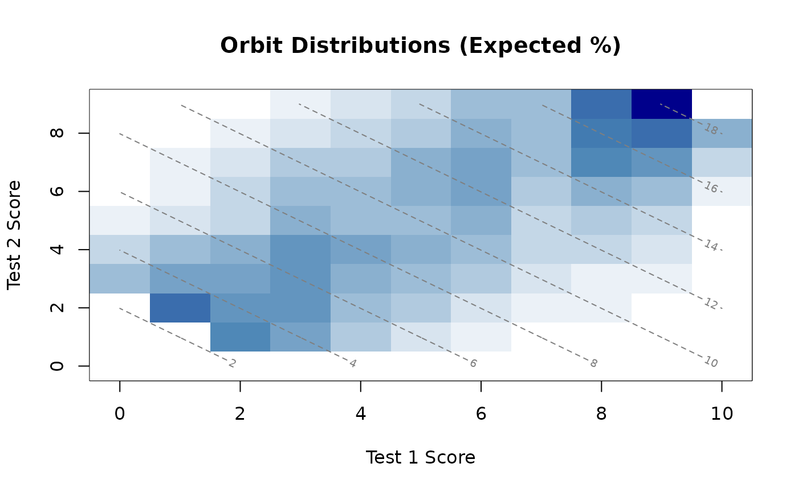
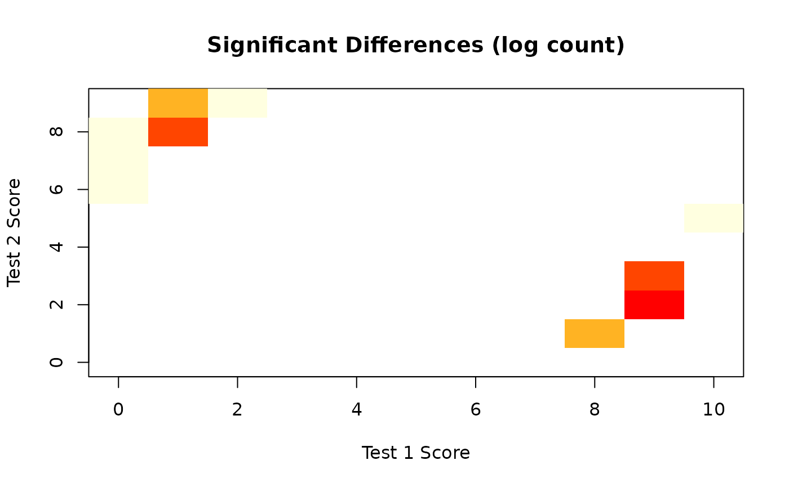
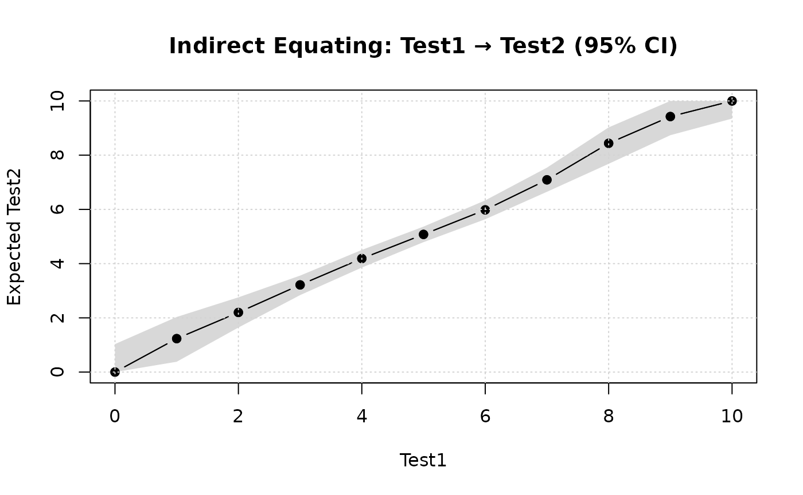
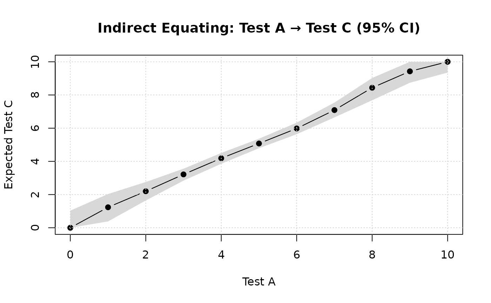

# Introduction to Leunbach test equating

This document provides an overview of how to do direct and indirect
equating using the `leunbachR` package for R, which is based on the
DIGRAM implementation of the Leunbach method.

Direct equating is made using the common person link between tests,
meaning that the same individuals have taken two different tests that do
not share any items.

Indirect equating connects test A and C through test B, where some
respondents have taken both tests A and B and some have taken both tests
B and C, but none have taken tests A and C, thus the indirect connection
between A and C through B.

A basic assumption of the Leunbach method is that the observed sum score
is a sufficient metric for the latent score, meaning that the items
underlying the sum score fulfill the psychometric requirements of a
Rasch model.

## Setup

First, we load the package and set our seed for reproducibility of
bootstrap results.

``` r
library(leunbachR)
set.seed(1234) # for reproducibility of bootstrap results
```

## Direct equating

Looking at our data, we can see that it has two variables containing sum
scores from the two tests that we want to equate. This is the type of
input expected by the functions in `leunbachR`. Data needs to be in the
form/class of either a data.frame or matrix.

``` r
d3a <- read.delim("data/data3a.csv", sep = ";")
head(d3a)
```

    ##   a_sum c_sum
    ## 1     1     8
    ## 2     4     4
    ## 3     4     7
    ## 4     6     3
    ## 5     8     5
    ## 6     6     6

First, we estimate the model.

``` r
fit <- leunbach_ipf(d3a, verbose = FALSE)
```

    ## Warning in leunbach_ipf(d3a, verbose = FALSE): Removed 2 rows with missing
    ## values

For most functions in this package, you can use
[`print()`](https://rdrr.io/r/base/print.html),
[`summary()`](https://rdrr.io/r/base/summary.html), and
[`plot()`](https://rdrr.io/r/graphics/plot.default.html) to investigate
the results. All functions have documentation that you can access using
for instance
[`?leunbach_ipf`](https://pgmj.github.io/leunbachR/reference/leunbach_ipf.md)
in the R console.

``` r
summary(fit)
```

    ## Leunbach Score Parameter Estimation - Summary
    ## ==============================================
    ## Power Series Distribution with Generalized Symmetric Functions
    ## 
    ## N = 498 observations
    ## Test 1: scores 0 to 10 (observed:  0 to 10)
    ## Test 2: scores 0 to 9 (observed: 1 to 9)
    ## Total:  scores 0 to 19 (observed:  1 to 19)
    ## 
    ## === Goodness of Fit ===
    ## 
    ## 1. Likelihood Ratio Test (observed vs expected counts):
    ##    Likelihood ratio G² =    53.75 (df = 63, p = 0.7904)
    ##    Pearson chi-square  =    49.08
    ## 
    ## 2. Goodman-Kruskal Gamma Test (one-sided):
    ##    Tests if observed correlation exceeds expected under the model.
    ##    Gamma (observed)    =  -0.0461
    ##    Gamma (expected)    =  -0.0501
    ##    Standard error      =   0.0395
    ##    Z statistic         =    -0.10 (p = 0.5405, one-sided)
    ## 
    ## 3. Orbit Analysis (person fit):
    ##    Run analyze_orbits() separately to assess the number of cases
    ##    outside 95% confidence regions of orbit distributions.
    ## 
    ## Converged: TRUE (after 23 iterations)

``` r
print(fit)
```

    ## Leunbach Score Parameter Estimation
    ## ====================================
    ## Power Series Distribution with Generalized Symmetric Functions
    ## 
    ## N = 498 observations
    ## 
    ## Test 1 score parameters (gamma):
    ## 
    ##  Score Frequency     Gamma Log_Gamma
    ##      0         4  1.000000  0.000000
    ##      1        15  3.307358  1.196150
    ##      2        33  6.817996  1.919566
    ##      3        72 14.259080  2.657394
    ##      4        84 16.280189  2.789949
    ##      5        94 18.105331  2.896206
    ##      6        88 17.476723  2.860870
    ##      7        44  9.027916  2.200322
    ##      8        41  8.427631  2.131516
    ##      9        20  4.179715  1.430243
    ##     10         3  0.651356 -0.428699
    ## 
    ## Test 2 score parameters (delta):
    ## 
    ##  Score Frequency    Delta Log_Delta
    ##      0         0 0.000000        NA
    ##      1        12 1.000000  0.000000
    ##      2        32 2.453814  0.897644
    ##      3        57 4.122441  1.416445
    ##      4        88 6.247856  1.832238
    ##      5        84 6.072293  1.803736
    ##      6        89 6.343274  1.847395
    ##      7        73 5.337807  1.674815
    ##      8        43 3.203051  1.164104
    ##      9        20 1.535259  0.428699
    ## 
    ## Total score parameters (sigma = Test1 + Test2):
    ## 
    ##  Score Frequency      Sigma Log_Sigma
    ##      0         0   0.000000        NA
    ##      1         0   1.000000  0.000000
    ##      2         0   5.761172  1.751141
    ##      3         2  19.056078  2.947386
    ##      4         4  50.871418  3.929301
    ##      5        14 106.112295  4.664498
    ##      6        25 185.860485  5.224996
    ##      7        39 285.824799  5.655379
    ##      8        54 378.957812  5.937425
    ##      9        70 453.576111  6.117163
    ##     10        61 487.507508  6.189306
    ##     11        61 466.066469  6.144328
    ##     12        82 407.843796  6.010884
    ##     13        35 313.515021  5.747847
    ##     14        21 214.873301  5.370049
    ##     15        13 131.201551  4.876735
    ##     16        11  67.296568  4.209109
    ##     17         5  29.803253  3.394618
    ##     18         1   8.503273  2.140451
    ##     19         0   1.000000  0.000000
    ## 
    ## Converged:  TRUE (after 23 iterations)
    ## 
    ## --- Goodness of Fit ---
    ## 
    ## 1. Likelihood Ratio Test:
    ##    LR = 53.75  DF = 63  p = 0.7904
    ## 
    ## 2. Goodman-Kruskal Gamma Test (one-sided):
    ##    Gamma (observed) = -0.0461
    ##    Gamma (expected) = -0.0501
    ##    SE = 0.0395
    ##    Z = -0.10  p = 0.5405
    ## 
    ## 3. Orbit Analysis:
    ##    Use analyze_orbits() to assess person fit within total score strata

### Analyze orbits

``` r
orb <- analyze_orbits(fit)
summary(orb)
```

    ## Leunbach Orbit Analysis - Summary
    ## ==================================
    ## 
    ## Significant differences between Test1 and Test2:
    ##   Test1  Test2     N    P(T1<T2)   P(T1>T2)
    ##   --------------------------------------------
    ##       0      6      1    0.0341          
    ##       0      7      1    0.0187          
    ##       0      8      1    0.0085          
    ##       1      8      3    0.0267          
    ##       1      9      2    0.0104          
    ##       2      9      1    0.0225          
    ##       8      1      2              0.0186
    ##       9      2      4              0.0234
    ##       9      3      3              0.0462
    ##      10      5      1              0.0301
    ## 
    ## 19 (3.8%) persons with significant differences
    ## 15.3 (3.1%) expected
    ## 
    ## 95% CI: [1.6%, 4.6%]
    ## Chi-square = 0.91, df = 1, p = 0.3388

``` r
print(orb)
```

    ## Leunbach Orbit Analysis
    ## =======================
    ## 
    ## N = 498 observations
    ## Significance level:  5.0%
    ## 
    ## Critical levels for person fit assessment:
    ## 
    ##  Score  N Crit_Left Crit_Right Crit_Combined DF
    ##      3  2     0.000      0.000         0.000  3
    ##      4  4     0.000      0.000         0.000  4
    ##      5 14     0.000      0.000         0.000  5
    ##      6 25     3.413      0.000         3.413  6
    ##      7 39     1.868      0.000         1.868  7
    ##      8 54     0.845      2.382         3.228  8
    ##      9 70     2.674      1.858         4.532  9
    ##     10 61     1.042      0.857         1.899  9
    ##     11 61     2.246      2.340         4.586  8
    ##     12 82     0.000      4.617         4.617  7
    ##     13 35     0.000      0.856         0.856  6
    ##     14 21     0.000      1.894         1.894  5
    ##     15 13     0.000      3.015         3.015  4
    ##     16 11     0.000      0.000         0.000  3
    ##     17  5     0.000      0.000         0.000  2
    ##     18  1     0.000      0.000         0.000  1
    ## 
    ## 19 (3.8%) persons with significant differences between measurements
    ## 15.3 (3.1%) expected
    ## 
    ## 95% Confidence interval: [1.6%, 4.6%]
    ## Chi-square = 0.91, df = 1, p = 0.3388

``` r
plot(orb)
```



``` r
plot(orb, type = "significant")
```



Specific total scores can also be analyzed.

``` r
get_orbit(orb, total_score = 5)
```

    ##   test1 test2 expected_pct cum_left cum_right observed
    ## 1     0     5         5.72     5.72    100.00        0
    ## 2     1     4        19.47    25.20     94.28        1
    ## 3     2     3        26.49    51.68     74.80        6
    ## 4     3     2        32.97    84.66     48.32        4
    ## 5     4     1        15.34   100.00     15.34        3
    ## 6     5     0         0.00   100.00      0.00        0

### Equating

``` r
leunbach_equate(fit, direction = "1to2")
```

    ## Leunbach Equating:  Test1 to Test2
    ## Method: optimize
    ## ==========================================
    ## 
    ##  Test1    Theta Expected_Test2 Rounded_Test2
    ##      0 -5.00000           1.00             1
    ##      1 -1.43602           1.73             2
    ##      2 -0.86290           2.51             3
    ##      3 -0.50963           3.37             3
    ##      4 -0.23484           4.29             4
    ##      5  0.00633           5.21             5
    ##      6  0.24214           6.09             6
    ##      7  0.50560           6.91             7
    ##      8  0.86585           7.69             8
    ##      9  1.57598           8.46             8
    ##     10  5.00000           9.00             9

### Bootstrap

If you have installed the package `mirai` and have a computer with
multiple CPU cores, you can significantly reduce the time needed for
bootstrap. Note that not all cores are equal. For instance, on a modern
Mac, you should only use the “performance cores”, not the “efficiency
cores”.

For the purposes of this vignette, we only use 100 bootstrap iterations.
It is recommended to use at least 1000.

``` r
boot <- leunbach_bootstrap(fit, n_cores = 4, verbose = TRUE, nsim = 100)
```

    ## Parametric Bootstrap for Leunbach Model
    ## ========================================
    ## 
    ## Optimization method: optimize
    ## Running 100 bootstrap samples using 4 cores...
    ## 
    ## Starting 4 daemons...
    ##   |                                                                              |                                                                      |   0%  |                                                                              |=                                                                     |   1%  |                                                                              |=                                                                     |   2%  |                                                                              |==                                                                    |   3%  |                                                                              |===                                                                   |   4%  |                                                                              |====                                                                  |   5%  |                                                                              |====                                                                  |   6%  |                                                                              |=====                                                                 |   7%  |                                                                              |======                                                                |   8%  |                                                                              |======                                                                |   9%  |                                                                              |=======                                                               |  10%  |                                                                              |========                                                              |  11%  |                                                                              |========                                                              |  12%  |                                                                              |=========                                                             |  13%  |                                                                              |==========                                                            |  14%  |                                                                              |==========                                                            |  15%  |                                                                              |===========                                                           |  16%  |                                                                              |============                                                          |  17%  |                                                                              |=============                                                         |  18%  |                                                                              |=============                                                         |  19%  |                                                                              |==============                                                        |  20%  |                                                                              |===============                                                       |  21%  |                                                                              |===============                                                       |  22%  |                                                                              |================                                                      |  23%  |                                                                              |=================                                                     |  24%  |                                                                              |==================                                                    |  25%  |                                                                              |==================                                                    |  26%  |                                                                              |===================                                                   |  27%  |                                                                              |====================                                                  |  28%  |                                                                              |====================                                                  |  29%  |                                                                              |=====================                                                 |  30%  |                                                                              |======================                                                |  31%  |                                                                              |======================                                                |  32%  |                                                                              |=======================                                               |  33%  |                                                                              |========================                                              |  34%  |                                                                              |========================                                              |  35%  |                                                                              |=========================                                             |  36%  |                                                                              |==========================                                            |  37%  |                                                                              |===========================                                           |  38%  |                                                                              |===========================                                           |  39%  |                                                                              |============================                                          |  40%  |                                                                              |=============================                                         |  41%  |                                                                              |=============================                                         |  42%  |                                                                              |==============================                                        |  43%  |                                                                              |===============================                                       |  44%  |                                                                              |================================                                      |  45%  |                                                                              |================================                                      |  46%  |                                                                              |=================================                                     |  47%  |                                                                              |==================================                                    |  48%  |                                                                              |==================================                                    |  49%  |                                                                              |===================================                                   |  50%  |                                                                              |====================================                                  |  51%  |                                                                              |====================================                                  |  52%  |                                                                              |=====================================                                 |  53%  |                                                                              |======================================                                |  54%  |                                                                              |======================================                                |  55%  |                                                                              |=======================================                               |  56%  |                                                                              |========================================                              |  57%  |                                                                              |=========================================                             |  58%  |                                                                              |=========================================                             |  59%  |                                                                              |==========================================                            |  60%  |                                                                              |===========================================                           |  61%  |                                                                              |===========================================                           |  62%  |                                                                              |============================================                          |  63%  |                                                                              |=============================================                         |  64%  |                                                                              |==============================================                        |  65%  |                                                                              |==============================================                        |  66%  |                                                                              |===============================================                       |  67%  |                                                                              |================================================                      |  68%  |                                                                              |================================================                      |  69%  |                                                                              |=================================================                     |  70%  |                                                                              |==================================================                    |  71%  |                                                                              |==================================================                    |  72%  |                                                                              |===================================================                   |  73%  |                                                                              |====================================================                  |  74%  |                                                                              |====================================================                  |  75%  |                                                                              |=====================================================                 |  76%  |                                                                              |======================================================                |  77%  |                                                                              |=======================================================               |  78%  |                                                                              |=======================================================               |  79%  |                                                                              |========================================================              |  80%  |                                                                              |=========================================================             |  81%  |                                                                              |=========================================================             |  82%  |                                                                              |==========================================================            |  83%  |                                                                              |===========================================================           |  84%  |                                                                              |============================================================          |  85%  |                                                                              |============================================================          |  86%  |                                                                              |=============================================================         |  87%  |                                                                              |==============================================================        |  88%  |                                                                              |==============================================================        |  89%  |                                                                              |===============================================================       |  90%  |                                                                              |================================================================      |  91%  |                                                                              |================================================================      |  92%  |                                                                              |=================================================================     |  93%  |                                                                              |==================================================================    |  94%  |                                                                              |==================================================================    |  95%  |                                                                              |===================================================================   |  96%  |                                                                              |====================================================================  |  97%  |                                                                              |===================================================================== |  98%  |                                                                              |===================================================================== |  99%  |                                                                              |======================================================================| 100%
    ## 
    ## 
    ## Bootstrap complete.
    ##   Valid samples: 100 of 100
    ##   Bootstrap p-value for LR test: 0.860
    ##   Average SEE (Test1 to Test2): 0.23
    ##   Average SEE (Test2 to Test1): 0.26

``` r
print(boot)
```

    ## Leunbach Model - Parametric Bootstrap Results
    ## ==============================================
    ## 
    ## Bootstrap samples: 100 (100 valid)
    ## Processing:  parallel (4 cores)
    ## Optimization method: optimize
    ## SEE type: rounded scores
    ## 
    ## Assessment of significance by parametric bootstrapping:
    ## 
    ## 1. Likelihood Ratio Test:
    ##    Observed LR = 53.75 (df = 63)
    ##    Asymptotic p-value:   p = 0.7904
    ##    Bootstrap p-value:   p = 0.8600
    ## 
    ## 2. Goodman-Kruskal Gamma Test (one-sided):
    ##    Observed Z = -0.10
    ##    Asymptotic p-value:   p = 0.5405
    ##    Bootstrap p-value:   p = 0.7000
    ## 
    ## Equating Test1 to Test2 (with 95% CI)
    ## ============================================================================
    ## 
    ##                                                                       Frequency of bootstrap errors
    ## Score      Theta  Rounded  Expected    95% CI          SEE      -2    -1     0    +1    +2
    ## --------------------------------------------------------------------------------------------------
    ##     0   -5.00000        1     1.00    [ 1.00,  1.00]   0.00     0.0   0.0 100.0   0.0   0.0
    ##     1   -1.43602        2     1.73    [ 1.29,  2.22]   0.34     0.0  13.0  87.0   0.0   0.0
    ##     2   -0.86290        3     2.51    [ 2.09,  2.96]   0.50     0.0  43.0  57.0   0.0   0.0
    ##     3   -0.50963        3     3.37    [ 3.08,  3.76]   0.42     0.0   0.0  78.0  22.0   0.0
    ##     4   -0.23484        4     4.29    [ 4.05,  4.56]   0.27     0.0   0.0  92.0   8.0   0.0
    ##     5    0.00633        5     5.21    [ 4.99,  5.44]   0.00     0.0   0.0 100.0   0.0   0.0
    ##     6    0.24214        6     6.09    [ 5.90,  6.34]   0.00     0.0   0.0 100.0   0.0   0.0
    ##     7    0.50560        7     6.91    [ 6.61,  7.24]   0.10     0.0   1.0  99.0   0.0   0.0
    ##     8    0.86585        8     7.69    [ 7.33,  8.09]   0.36     0.0  15.0  85.0   0.0   0.0
    ##     9    1.57598        8     8.46    [ 8.14,  9.00]   0.50     0.0   0.0  53.0  47.0   0.0
    ##    10    5.00000        9     9.00    [ 9.00,  9.00]   0.00     0.0   0.0 100.0   0.0   0.0
    ## --------------------------------------------------------------------------------------------------
    ## Average SEE: 0.23
    ## 
    ## Equating Test2 to Test1 (with 95% CI)
    ## ============================================================================
    ## 
    ##                                                                       Frequency of bootstrap errors
    ## Score      Theta  Rounded  Expected    95% CI          SEE      -2    -1     0    +1    +2
    ## --------------------------------------------------------------------------------------------------
    ##     1   -5.00000        0     0.00    [ 0.00,  0.00]   0.10     0.0   0.0  99.0   1.0   0.0
    ##     2   -1.18397        1     1.36    [ 0.74,  1.90]   0.45     0.0   0.0  72.0  28.0   0.0
    ##     3   -0.64238        3     2.59    [ 2.06,  2.92]   0.49     0.0  37.0  63.0   0.0   0.0
    ##     4   -0.31551        4     3.69    [ 3.30,  3.95]   0.30     0.0  10.0  90.0   0.0   0.0
    ##     5   -0.04910        5     4.76    [ 4.52,  5.02]   0.14     0.0   2.0  98.0   0.0   0.0
    ##     6    0.21610        6     5.89    [ 5.64,  6.14]   0.00     0.0   0.0 100.0   0.0   0.0
    ##     7    0.53922        7     7.11    [ 6.73,  7.55]   0.22     0.0   0.0  95.0   5.0   0.0
    ##     8    1.07404        8     8.39    [ 7.89,  8.83]   0.46     0.0   0.0  70.0  30.0   0.0
    ##     9    5.00000       10    10.00    [ 9.00, 10.00]   0.20     0.0   4.0  96.0   0.0   0.0
    ## --------------------------------------------------------------------------------------------------
    ## Average SEE: 0.26

You can also get the equating table as a separate object.

``` r
get_equating_table(boot)
```

    ##    Test1 log_theta rounded expected ci_lower ci_upper  see
    ## 0      0   -5.0000       1     1.00     1.00     1.00 0.00
    ## 1      1   -1.4360       2     1.73     1.29     2.22 0.34
    ## 2      2   -0.8629       3     2.51     2.09     2.96 0.50
    ## 3      3   -0.5096       3     3.37     3.08     3.76 0.42
    ## 4      4   -0.2348       4     4.29     4.05     4.56 0.27
    ## 5      5    0.0063       5     5.21     4.99     5.44 0.00
    ## 6      6    0.2421       6     6.09     5.90     6.34 0.00
    ## 7      7    0.5056       7     6.91     6.61     7.24 0.10
    ## 8      8    0.8659       8     7.69     7.33     8.09 0.36
    ## 9      9    1.5760       8     8.46     8.14     9.00 0.50
    ## 10    10    5.0000       9     9.00     9.00     9.00 0.00

Write the table to a CSV file.

``` r
write.csv(get_equating_table(boot), file = "eqtable.csv")
```

## Indirect equating

For this, we read a dataset with three tests.

``` r
d1 <- read.delim("data/data1.csv", sep = ";")
head(d1)
```

    ##   a_sum b_sum c_sum
    ## 1     2     4    NA
    ## 2     2     5    NA
    ## 3     5     7    NA
    ## 4     4     5    NA
    ## 5     5     5    NA
    ## 6     7     7    NA

We will estimate two models before the indirect equating procedure. Test
A with Test B; and Test B with Test C. Then the results will be used to
indirectly equate Test A with Test C

The code below uses base R methods to select the columns in the
dataframe, first 1 and 2, second 2 and 3.

``` r
fit_ab <- leunbach_ipf(d1[,c(1,2)])
```

    ## Warning in leunbach_ipf(d1[, c(1, 2)]): Removed 500 rows with missing values

``` r
fit_bc <- leunbach_ipf(d1[,c(2,3)])
```

    ## Warning in leunbach_ipf(d1[, c(2, 3)]): Removed 500 rows with missing values

You can of course use the objects `fit_ab` and `fit_bc` to analyze
orbits too, but we’ll skip that step here.

``` r
indirect1 <- leunbach_indirect_equate(fit_ab, fit_bc,
                                     direction_ab = "1to2",
                                     direction_bc = "1to2")
print(indirect1)
```

    ## Leunbach Indirect Equating
    ## ==========================
    ## 
    ## Path: Test1 -> Test2 -> Test2
    ## Method: optimize
    ## 
    ## Source (Test1) range:  0 to 10
    ## Anchor (Test2) range: 0 to 10
    ## Target (Test2) range: 0 to 10
    ## 
    ##  Test1    Theta Expected_Test2 Rounded_Test2
    ##      0  -5.0000           0.00             0
    ##      1  -2.0865           1.23             1
    ##      2  -1.4308           2.20             2
    ##      3  -0.9309           3.22             3
    ##      4  -0.4880           4.19             4
    ##      5  -0.0846           5.08             5
    ##      6   0.3154           5.98             6
    ##      7   0.7833           7.09             7
    ##      8   1.4251           8.44             8
    ##      9   2.3503           9.42             9
    ##     10   5.0000          10.00            10

### Bootstrap

Again, only using 100 simulations for demonstration purposes.

``` r
boot_indirect1 <- leunbach_indirect_bootstrap(fit_ab, fit_bc,
                                             direction_ab = "1to2",
                                             direction_bc = "1to2",
                                             nsim = 100,
                                             verbose = TRUE, n_cores = 4)
```

    ## Parametric Bootstrap for Indirect Equating
    ## ===========================================
    ## 
    ## Path: Test1 -> Test2 -> Test2
    ## Optimization method: optimize
    ## Running 100 bootstrap samples using 4 cores...
    ## 
    ## Starting 4 daemons...
    ##   |                                                                              |                                                                      |   0%  |                                                                              |=                                                                     |   1%  |                                                                              |=                                                                     |   2%  |                                                                              |==                                                                    |   3%  |                                                                              |===                                                                   |   4%  |                                                                              |====                                                                  |   5%  |                                                                              |====                                                                  |   6%  |                                                                              |=====                                                                 |   7%  |                                                                              |======                                                                |   8%  |                                                                              |======                                                                |   9%  |                                                                              |=======                                                               |  10%  |                                                                              |========                                                              |  11%  |                                                                              |========                                                              |  12%  |                                                                              |=========                                                             |  13%  |                                                                              |==========                                                            |  14%  |                                                                              |==========                                                            |  15%  |                                                                              |===========                                                           |  16%  |                                                                              |============                                                          |  17%  |                                                                              |=============                                                         |  18%  |                                                                              |=============                                                         |  19%  |                                                                              |==============                                                        |  20%  |                                                                              |===============                                                       |  21%  |                                                                              |===============                                                       |  22%  |                                                                              |================                                                      |  23%  |                                                                              |=================                                                     |  24%  |                                                                              |==================                                                    |  25%  |                                                                              |==================                                                    |  26%  |                                                                              |===================                                                   |  27%  |                                                                              |====================                                                  |  28%  |                                                                              |====================                                                  |  29%  |                                                                              |=====================                                                 |  30%  |                                                                              |======================                                                |  31%  |                                                                              |======================                                                |  32%  |                                                                              |=======================                                               |  33%  |                                                                              |========================                                              |  34%  |                                                                              |========================                                              |  35%  |                                                                              |=========================                                             |  36%  |                                                                              |==========================                                            |  37%  |                                                                              |===========================                                           |  38%  |                                                                              |===========================                                           |  39%  |                                                                              |============================                                          |  40%  |                                                                              |=============================                                         |  41%  |                                                                              |=============================                                         |  42%  |                                                                              |==============================                                        |  43%  |                                                                              |===============================                                       |  44%  |                                                                              |================================                                      |  45%  |                                                                              |================================                                      |  46%  |                                                                              |=================================                                     |  47%  |                                                                              |==================================                                    |  48%  |                                                                              |==================================                                    |  49%  |                                                                              |===================================                                   |  50%  |                                                                              |====================================                                  |  51%  |                                                                              |====================================                                  |  52%  |                                                                              |=====================================                                 |  53%  |                                                                              |======================================                                |  54%  |                                                                              |======================================                                |  55%  |                                                                              |=======================================                               |  56%  |                                                                              |========================================                              |  57%  |                                                                              |=========================================                             |  58%  |                                                                              |=========================================                             |  59%  |                                                                              |==========================================                            |  60%  |                                                                              |===========================================                           |  61%  |                                                                              |===========================================                           |  62%  |                                                                              |============================================                          |  63%  |                                                                              |=============================================                         |  64%  |                                                                              |==============================================                        |  65%  |                                                                              |==============================================                        |  66%  |                                                                              |===============================================                       |  67%  |                                                                              |================================================                      |  68%  |                                                                              |================================================                      |  69%  |                                                                              |=================================================                     |  70%  |                                                                              |==================================================                    |  71%  |                                                                              |==================================================                    |  72%  |                                                                              |===================================================                   |  73%  |                                                                              |====================================================                  |  74%  |                                                                              |====================================================                  |  75%  |                                                                              |=====================================================                 |  76%  |                                                                              |======================================================                |  77%  |                                                                              |=======================================================               |  78%  |                                                                              |=======================================================               |  79%  |                                                                              |========================================================              |  80%  |                                                                              |=========================================================             |  81%  |                                                                              |=========================================================             |  82%  |                                                                              |==========================================================            |  83%  |                                                                              |===========================================================           |  84%  |                                                                              |============================================================          |  85%  |                                                                              |============================================================          |  86%  |                                                                              |=============================================================         |  87%  |                                                                              |==============================================================        |  88%  |                                                                              |==============================================================        |  89%  |                                                                              |===============================================================       |  90%  |                                                                              |================================================================      |  91%  |                                                                              |================================================================      |  92%  |                                                                              |=================================================================     |  93%  |                                                                              |==================================================================    |  94%  |                                                                              |==================================================================    |  95%  |                                                                              |===================================================================   |  96%  |                                                                              |====================================================================  |  97%  |                                                                              |===================================================================== |  98%  |                                                                              |===================================================================== |  99%  |                                                                              |======================================================================| 100%
    ## 
    ## 
    ## Bootstrap complete.
    ##   Valid samples: 100 of 100
    ##   Bootstrap p-value for LR test (A-B): 0.060
    ##   Bootstrap p-value for LR test (B-C): 0.130
    ##   Bootstrap p-value for Gamma test (A-B): 0.780
    ##   Bootstrap p-value for Gamma test (B-C): 0.970
    ##   Average SEE: 0.31

``` r
print(boot_indirect1)
```

    ## Leunbach Indirect Equating - Parametric Bootstrap Results
    ## ==========================================================
    ## 
    ## Path: Test1 -> Test2 -> Test2
    ## Bootstrap samples: 100 (100 valid)
    ## Processing:  parallel (4 cores)
    ## Optimization method: optimize
    ## SEE type: rounded scores
    ## 
    ## Assessment of significance by parametric bootstrapping:
    ## 
    ## Equating A-B (Test1 -> Test2):
    ##   1. Likelihood Ratio Test:
    ##      Observed LR = 77.72 (df = 79)
    ##      Asymptotic p-value:    p = 0.5197
    ##      Bootstrap p-value:    p = 0.0600
    ##   2. Goodman-Kruskal Gamma Test (one-sided):
    ##      Observed Z = -0.10
    ##      Asymptotic p-value:   p = 0.5404
    ##      Bootstrap p-value:    p = 0.7800
    ## 
    ## Equating B-C (Test2 -> Test2):
    ##   1. Likelihood Ratio Test:
    ##      Observed LR = 82.73 (df = 80)
    ##      Asymptotic p-value:    p = 0.3950
    ##      Bootstrap p-value:    p = 0.1300
    ##   2. Goodman-Kruskal Gamma Test (one-sided):
    ##      Observed Z = -0.26
    ##      Asymptotic p-value:   p = 0.6021
    ##      Bootstrap p-value:    p = 0.9700
    ## 
    ## Indirect Equating: Test1 -> Test2 (with 95% CI)
    ## =======================================================================================
    ## 
    ##                                                                          Frequency of bootstrap errors
    ## Score      Theta  Rounded  Expected    95% CI          SEE      -2    -1     0    +1    +2   Failed%
    ## --------------------------------------------------------------------------------------------------------
    ##     0   -5.00000        0     0.00    [ 0.00,  1.03]   0.51     0.0   0.0  61.0  38.0   1.0     0.0%
    ##     1   -2.08654        1     1.23    [ 0.38,  2.03]   0.55     0.0   5.0  63.0  32.0   0.0     0.0%
    ##     2   -1.43075        2     2.20    [ 1.64,  2.76]   0.39     0.0   2.0  83.0  15.0   0.0     0.0%
    ##     3   -0.93091        3     3.22    [ 2.84,  3.56]   0.30     0.0   0.0  90.0  10.0   0.0     0.0%
    ##     4   -0.48803        4     4.19    [ 3.85,  4.51]   0.17     0.0   0.0  97.0   3.0   0.0     0.0%
    ##     5   -0.08464        5     5.08    [ 4.79,  5.37]   0.00     0.0   0.0 100.0   0.0   0.0     0.0%
    ##     6    0.31545        6     5.98    [ 5.64,  6.33]   0.00     0.0   0.0 100.0   0.0   0.0     0.0%
    ##     7    0.78325        7     7.09    [ 6.65,  7.54]   0.26     0.0   2.0  93.0   5.0   0.0     0.0%
    ##     8    1.42505        8     8.44    [ 7.68,  9.02]   0.50     0.0   0.0  53.0  47.0   0.0     0.0%
    ##     9    2.35035        9     9.42    [ 8.74, 10.00]   0.52     0.0   1.0  52.0  47.0   0.0     0.0%
    ##    10    5.00000       10    10.00    [ 9.35, 10.00]   0.21     0.0   4.5  95.5   0.0   0.0    12.0%
    ## --------------------------------------------------------------------------------------------------------
    ## Average SEE: 0.31

``` r
summary(boot_indirect1)
```

    ## Leunbach Indirect Equating - Bootstrap Summary
    ## ===============================================
    ## 
    ## Path: Test1 -> Test2 -> Test2
    ## Bootstrap samples:  100 (100 valid)
    ## Confidence level: 95%
    ## SEE type: rounded scores
    ## 
    ## Model Fit Summary:
    ## 
    ## Equating A-B (Test1 -> Test2):
    ##   LR test:     asymptotic p = 0.5197, bootstrap p = 0.0600
    ##   Gamma test:  asymptotic p = 0.5404, bootstrap p = 0.7800
    ## 
    ## Equating B-C (Test2 -> Test2):
    ##   LR test:     asymptotic p = 0.3950, bootstrap p = 0.1300
    ##   Gamma test: asymptotic p = 0.6021, bootstrap p = 0.9700
    ## 
    ## Average SEE: 0.31
    ## 
    ## Scores with >5% bootstrap failures:
    ##   Score 10: 12.0% failed

Get a clean table and write to a CSV file.

``` r
indirect_table <- get_indirect_equating_table(boot_indirect1)
indirect_table
```

    ##    Test1 log_theta rounded expected ci_lower ci_upper  see pct_failed
    ## 0      0   -5.0000       0     0.00     0.00     1.03 0.51          0
    ## 1      1   -2.0865       1     1.23     0.38     2.03 0.55          0
    ## 2      2   -1.4308       2     2.20     1.64     2.76 0.39          0
    ## 3      3   -0.9309       3     3.22     2.84     3.56 0.30          0
    ## 4      4   -0.4880       4     4.19     3.85     4.51 0.17          0
    ## 5      5   -0.0846       5     5.08     4.79     5.37 0.00          0
    ## 6      6    0.3154       6     5.98     5.64     6.33 0.00          0
    ## 7      7    0.7833       7     7.09     6.65     7.54 0.26          0
    ## 8      8    1.4251       8     8.44     7.68     9.02 0.50          0
    ## 9      9    2.3503       9     9.42     8.74    10.00 0.52          0
    ## 10    10    5.0000      10    10.00     9.35    10.00 0.21         12

``` r
write.csv(indirect_table, file = "indirect_table.csv")
```

``` r
plot(boot_indirect1, type = "equating")
```



``` r
plot(boot_indirect1, type = "see")
```


